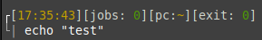

## Info
Repo containing Ansible playbooks for Debian-based distros customization 

## Prerequisities
- [Ansible](https://docs.ansible.com/ansible/latest/installation_guide/intro_installation.html) installed
- generate key pair and copy it to managed host
```sh
ssh-keygen -t ed25519 -C "ansible key" -f ~/.ssh/ansible
ssh-copy-id -i ~/.ssh/ansible.pub <user>@<host>
```
- in **ansible.cfg** file -> specify **remote user**

## Running playbook
```sh
ansible-playbook --ask-become-pass <playbook-name>.yml
```

## List of playbooks
| file | description | image |
| ------ | ------ | ------ |
| [custom_prompt](custom_prompt.yml) | customization for **PS1** variable |  |